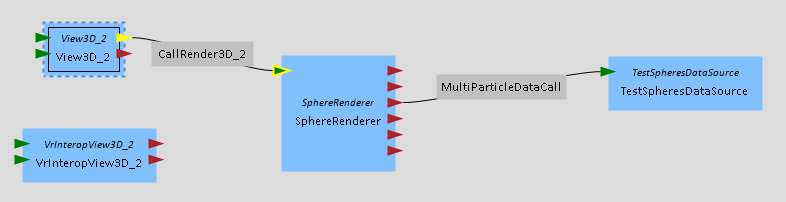
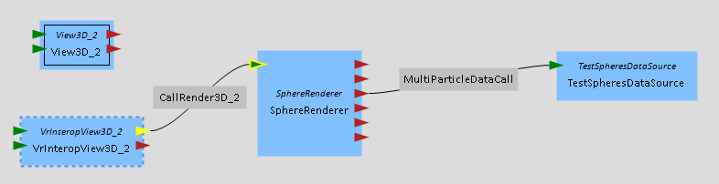
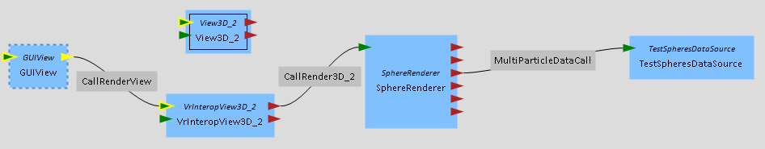
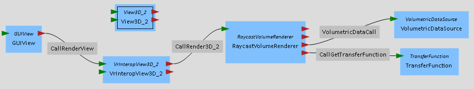
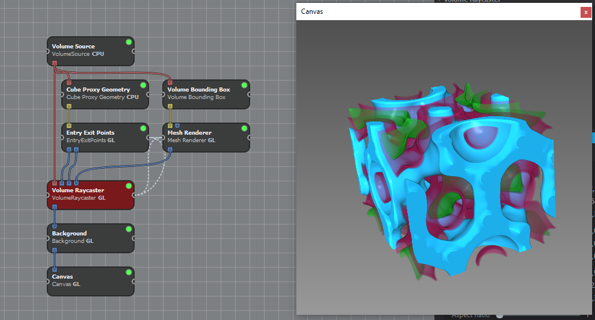
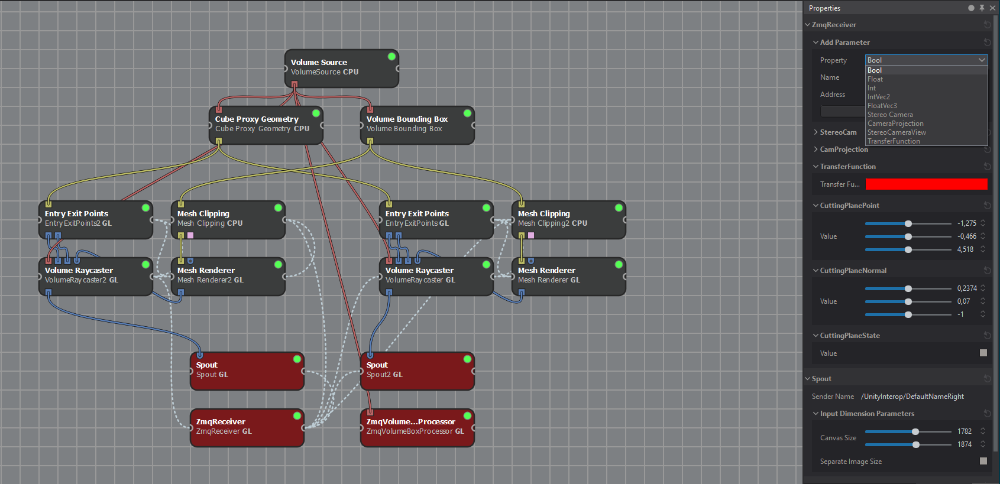
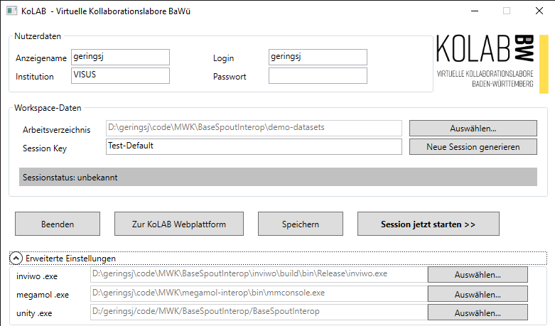

# How To and Further Details - Unity Kolab Environment

# Contents

* [Application Setup: Step by Step](#Application-Setup:-Step-by-Step)
* [Interacting with the Kolab Environment](#Interacting-with-the-Kolab-Environment)
* [System Architecture Overview](#System-Architecture-Overview)
* [The Unity Implementation](#The-Unity-Implementation)
* [Unity/Renderer Interop Protocol](#Unity/Renderer-Interop-Protocol)
* [Getting VR-capable Renderer Projects](#Getting-VR-capable-Renderer-Projects)
* [Collaborative Mode via Photon](#Collaborative-Mode-via-Photon)
* [Issues and Future Work](#Issues-and-Future-Work)

# Application Setup: Step by Step

Getting the Kolab Environment up and running requires you to set up five key components of the system:
1. [Set up VR hardware and software](#1.-Setting-up-VR-Hardware-and-Software-on-Machine) on your machine. UnityKolabEnv requires **SteamVR** with a compatible **VR headset**, e.g. HTC VIVE (Pro).
2. [Run Unity Kolab Environment](#2.-Run-UnityKolabEnv) (this repository) in Unity 2019.1.1f1. Higher Unity versions may work but are not tested.
3. [Compile or download a SciVis Rendering Software](#3.-Get-VR-Compatible-SciVis-Renderers) that provides VR-Rendering components that connect to UnityKolabEnv, i.e. MegaMol or inviwo with their respective VR plugins/modules.
4. [Get Scientific Datasets and VR-compatible project-files](#4.-Scientific-Datasets-and-Renderer-VR-Projects) for your SciVis Renderers
5. [Set up the KolabLoader](#5.-Set-up-the-KolabLoader) with correct paths to the SciVis Renderers so UnityKolabEnv can find them

## 1. Setting up VR Hardware and Software on Machine

To properly set up your **VR headset** follow the instructions of the headset vendor. 
We tested UnityKolabEnv with the HTC VIVE and HTC VIVE Pro during development, but other VR headsets will probably also work as long as they are SteamVR-compatible. 
UnityKolabEnv uses the OpenVR API interface of Unity to talk to VR hardware. 
This means that you need SteamVR (see [steampowered.com/steamvr](https://store.steampowered.com/steamvr)) and compatible VR hardware to use UnityKolabEnv.

## 2. Run UnityKolabEnv

Clone this git repository and make sure to also correctly check out [git LFS](https://git-lfs.github.com/) files - thus, install configure [git LFS](https://git-lfs.github.com/) before cloning this repository.
```
*install git LFS on computer, then do*
git lfs install
git clone https://github.com/UniStuttgart-VISUS/MWK-UnityKolabEnv.git
```
To run UnityKolabEnv you need Unity in version 2019.1.1f1. 
Higher Unity versions may work but are not tested.
You can run UnityKolabEnv by opening the cloned repository as a Unity Project.
In the ``Assets`` directory you find the two main Scenes of the project: 
* The ``Workspaces`` scene contains UI elements and logic to start a collaborative remote session to which other users can connect via network
* The ``MintMain`` scene contains the implementation of the environment for scientific dataset analysis. When started, it will initiate an offline session where everything works as usual, but without remote collaboration

Note that UnityKolabEnv checks the congifuration file ``BaseSpoutInteropsettings.json`` in the user directory at ``AppData\LocalLow\UlmUniversity\``. This file is written and managed by the KolabLoader and UnityKolabEnv may not be fully functional until this file is configured properly. If UnityKolabEnv does not behave as expected, one source of error may be a wrong configuration in this file. 

You can also build a standalone executable of UnityKolabEnv using Unity (see [unity3d.com/Manual/PublishingBuilds](https://docs.unity3d.com/Manual/PublishingBuilds.html)). 
Make sure the build contains the scenes ``Workspaces`` and ``MintMain``.
Users can run the resulting standalone executable of UnityKolabEnv without having Unity installed.
For technical reasons the VR environment currently only works on Windows operating systems, it has been developed and tested on Windows 10.

## 3. Get VR-Compatible SciVis Renderers

Currently two scientific visualization renderers can interface with UnityKolabEnv: 

* inviwo, developed by the viscom group at Ulm University, [inviwo.org](https://inviwo.org/), [github.com/inviwo/inviwo](https://github.com/inviwo/inviwo)
* MegaMol, developed by VISUS at University of Stuttgart, [megamol.org](https://megamol.org/), [github.com/UniStuttgart-VISUS/megamol](https://github.com/UniStuttgart-VISUS/megamol)

You need a renderer that understands how to communicate with UnityKolabEnv to look at and analyze datasets visualized by that renderer in virtual reality.
MegaMol and inviwo each bring a set of modules or plugins that implement the communication protocol with UnityKolabEnv. 
You can find the source code for the inviwo and MegaMol interop-communication plugins at:

* inviwo: [github.com/geringsj/inviwo at branch **mint**](https://github.com/geringsj/inviwo/tree/mint)
* MegaMol: [github.com/UniStuttgart-VISUS/megamol at branch **vrinterop**](https://github.com/UniStuttgart-VISUS/megamol/tree/vrinterop)

Clone the repositories, check out the VR-feature branches and build MegaMol and inviwo according to the instructions of each framework.

* [How to build Inviwo](https://github.com/inviwo/inviwo/blob/master/docs/markdown/GettingStarted_Build.md)
* [Building MegaMol](https://github.com/UniStuttgart-VISUS/megamol#building-megamol)

Both frameworks require CMake for configuration and a modern Visual Studio installation for compilation. 
The VR plugins utilize software libraries that are currently only available for Windows operating systems.
Be aware that the source code may depend on git submodules and you should check out the repositories to also initiate submodules.

* inviwo: 
    ```
    git clone --recurse-submodules https://github.com/geringsj/inviwo
    cd inviwo
    git checkout mint
    *configure with CMake and compile*
    ```
    Make sure to also build the **ZMQ** (ZeroMQ) and **Spout** modules during configuration in CMake.
    Inviwo requires Qt libraries and Python to compile, see the inviwo documentation for details.

* MegaMol: 
    ```
    git clone --recursive https://github.com/UniStuttgart-VISUS/megamol.git
    cd megamol
    git checkout vrinterop
    *configure with CMake and compile*
    ```
    Make sure to also build the **vrinterop** plugin during configuration in CMake

Verify that each rendering software works as expected, e.g. by running example projects provided by the frameworks. 
If the frameworks work as expected, the frameworks' VR components can be added to project files to achieve data visualization in VR with UnityKolabEnv.

## 4. Scientific Datasets and Renderering VR-Projects

Each rendering framework is specialized for rendering certain scientific data sets.
Both inviwo and MegaMol provide example projects that show how to visualize certain data formats with the respective framework.
If you would like to visualize your own data in VR with one of the mentioned frameworks you should consult the respective documentation or talk to the developers of the framework. 
As soon as you have a project file that renders your data successfully, you can look at your data in VR by adding VR components to the visualization process.
MegaMol and inviwo use slightly different approaches to add VR-capabilities to existing project files.
Note that you need to configure the KolabLoader accordingly so UnityKolabEnv is aware of the directories where relevant project files for the renderers can be found.

### 4.1 MegaMol VR-Interop Projects

MegaMol comes with the MegaMol Configurator application that allows you to easily put together and configure MegaMol projects.
When configuring and building MegaMol in CMake make sure to also include the Configurator. 
After compilation the Configurator can be found in ``megamol/bin/MegaMolConf.exe``.



MegaMol projects use **View modules** as entry points into the MegaMol graph. 
The MegaMol graph is a network of renderer and configuration modules that load data and establish the order in which rendering occurs. 
Usually the **View3D_2** module is used as the view for a MegaMol project by connecting it to the first renderer in the graph, see the picture above. 



To make your MegaMol project VR-ready for UnityKolabEnv, you need to use the **VrInteropView3D_2** module and connect it to the MegaMol graph instead of the View3D_2.
**VrInteropView3D_2** handles all communication with UnityKolabEnv and configures MegaMol to render stereo images as required by the VR Kolab session.



If you want to have a GUI to modify MegaMol parameters while MegaMol is running you need to connect a **GUIView** to your MegaMol graph as shown in the image above.

MegaMol currently has two project file formats: 
* **.mmprj** - the legacy project format. **UnityKolanEnv currently only supports loading this format**.
* **.lua** - the new MegaMol project format

When saving your project to disk, pay attention to save it as **.mmprj**. 
To be safe you should also save your project in **.lua** format because the MegaMol Configurator will eventually stop supporting the legacy **.mmprj** format and all tooling will switch to the new format. 
Support for **.lua** projects will be added to UnityKolabEnv soonish.

**Example data and VR projects for MegaMol** 
are provided by MegaMol if during CMake configuration you select **Examples** to be build. 
Starting from those examples in the ``megamol/examples`` directory you can try out MegaMol and adapt the example projects for VR.
You can also easily put together small example projects yourself to try out MegaMol in the VR environment. 

The example shown above using the **SphereRenderer** and **TestSphereDataSource** is a small project that renders spheres without the need to provide input particle data from a file. Note that on AMD graphics hardware there are currently driver bugs that prevent MegaMol from rendering particles correctly. 



The MegaMol graph shown above uses volume rendering modules to render a volumetric dataset in **.dat** format in VR. Note that for volume rendering to work correctly you need to connect a **TransferFunction** module to the **RaycastVolumeRenderer**. The initial values of the transfer function may not be optimal to look at your volume - you need to adjust the transfer function during runtime to suit your data.

### 4.2 Inviwo VR-Interop Projects

When starting inviwo the first time you are presented with example projects that are bundled with inviwo.
One simple example project is **boron.inv**, shown below.



To make an inviwo project VR-ready you need to adapt the inviwo processor network to render two images - one for the left eye and one for the right. The two resulting images should be exported to UnityKolabEnv using **Spout** processors with their Sender Name properties set to ``/UnityInterop/DefaultNameLeft`` and ``/UnityInterop/DefaultNameRight`` for the left and right image, respectively.

You need a **ZmqReceiver** processor to receive rendering data broadcasted by UnityKolabEnv and a **ZmqVolumeBoxProcessor** to broadcast bounding box information to UnityKolabEnv.  The ZmqReceiver processor needs to be configured to receive certain data values and pass them to the appropriate processors in the processor network.  This provides inviwo with the VR rendering parameters to render images that correspond to the scene in VR.

In the *AddParameter* propertiy of the ZmqReceiver add the following **Properties** and connect them to processors in the network. Make sure to use the **Address** values stated below, or else received data may not be assigned correctly to the properties. In the image below you can see an example configuration of an inviwo network for VR rendering with UnityKolabEnv. The processors marked red are processors that are responsible for communicating VR rendering data - either receiving rendering state and distributing it in the network (ZmqRecevier) or broadcasting rendering results back to UnityKolabEnv (Spout, ZmqVolumeBoxProcessor).

The inviwo **mint** branch at [github.com/geringsj/inviwo](https://github.com/geringsj/inviwo/tree/mint) contains a VR-ready example project at ``inviwo/data/workspaces/boron-interop.inv`` that extends the *boron.inv* and uses all VR interop features currently implemented. Note that some properties and property values of the *ZmqReceiver* processor (e.g. the addresses mentioned below) are not shown in the inviwo GUI and you need to inspect the project file in a text editor to see the full configuration of the processor.

| Property Type | Name | Address | Description |
|----------|------|---------|-------------|
| Stereo Camera | StereoCam | StereoCameraViewRelative | Pass the configuration of the left and right camera to the corresponding processors in the network rendering the left and right image. |
| CameraProjection | CamProjection | CameraProjection | Pass the camera projection configuration to all processors with a camera. Also connect the *Canvas Size* property to the *Spout* processors. |
| TransferFunction (optional) | TransferFunction | TransferFunction | Adding and connecting the TransferFunction property enables manipulating the Transfer Function Widget in VR. |
| FloatVec3 (optional) | CuttingPlanePoint | CuttingPlanePoint | Connecting the Cutting Plane Point, Normal and State to the **Mesh Clipping** processor enables using the Cutting Plane Widget in the VR environment. Use all three of them at once. |
| FloatVec3 (optional) | CuttingPlaneNormal | CuttingPlaneNormal | Connecting the Cutting Plane Point, Normal and State to the **Mesh Clipping** processor enables using the Cutting Plane Widget in the VR environment. Use all three of them at once. |
| Bool (optional) | CuttingPlaneState | CuttingPlaneState | Connecting the Cutting Plane Point, Normal and State to the **Mesh Clipping** processor enables using the Cutting Plane Widget in the VR environment. Use all three of them at once. |



## 5. Setting up KolabLoader

The KolabLoader has two responsibilities: 
1. Write the configuration file ``BaseSpoutInteropsettings.json`` and provide a GUI to manipulate its configurations
2. Act as launcher application for standalone builds of UnityKolabEnv 

``BaseSpoutInteropsettings.json`` is located in the user directory at ``AppData\LocalLow\UlmUniversity\`` and contains user-specific configuration regarding collaborative network sessions (e.g. username), paths to the MegaMol and inviwo executables as well as the directory where project files for the renderers are located.

Download and build the source code for KolabLoader from [github.com/UniStuttgart-VISUS/MWK-KolabLoader](https://github.com/UniStuttgart-VISUS/MWK-KolabLoader).
KolabLoader comes with a Visual Studio Solution file and was tested only on Windows. 

After building the project the application is located in ``MWK-KolabLoader\KolabLoader\bin\Debug\KolabLoader.exe``.
Starting the KolabLoader you will see the following GUI:



There are three sections thatyou need to provide with inputs: Your user data, the path to workspace/project data on your system, and paths to the MegaMol, inviwo and UnityKolabEnv executables. 
Note that the inviwo and MegaMol executables are expected to support VR sessions as described above, i.e. they are compiled with VR support. 
The Unity exutable configured in the GUI is called when you use the *Session Start* button in the KolabLuader GUI to start a session, thus a path to an executable build of UnityKolabEnv is expected and only used for starting UnityKolabEnv sessions from the KolabLoader. 

The inviwo and MegaMol executables however are used by UnityKolabEnv to start VR projects found in the path for the workspace/project directory. 
This means that you need to place your inviwo and MegaMol VR-project files into one joint directory and make UnityKolabEnv make aware of it.
The Login and Passwort fields are placeholders for now, your Name and Institution are displayed in VR remote sessions as identification. 
The Session Key is used as the name for network sessions you start or would like to join. If a network session with that name does not exist when starting UnityKolanEnv, a new session with that name will be initialized. If a network session with that name already exists, UnityKolabEnv will join that session.

Below you can see the contents of a JSON configuration file. 
Note that the comments explaining the JSON parameters are not valid JSON code and should be removed when using this configuration. 
In addition to the user identification, project and executable paths the file also stores several options that manage network session creation, rendering and collision detection for local collaborative sessions.
```JSON
{
    "_nickname": "geringsj",
    "_institution": "VISUS",
    "_username": "geringsj",
    "_password": "undefined",
    "_workspacesPath": "D:\\geringsj\\code\\MWK\\BaseSpoutInterop\\demo-datasets",
    "_session": "Test-Default",
    "_projectPath": "D:/geringsj/code/MWK/BaseSpoutInterop/BaseSpoutInterop",
    "_inviwoPath": "D:\\geringsj\\code\\MWK\\BaseSpoutInterop\\inviwo\\build\\bin\\Release\\inviwo.exe",
    "_megamolPath": "D:\\geringsj\\code\\MWK\\megamol-interop\\bin\\mmconsole.exe",
    "_useInviwoPositioning": false, // unused, legacy
    "_rttVisualization": false, // unused, legacy
    "_createRoomOnLoad": false, // immediately starts a session when starting UnityKolanEnv
    "_autoJoinFirstRoomOnLoad": false, // joins first network session found when starting UnityKolanEnv
    "_externalRendererMode": true,
    "_desktopMode": false, // disables stereo rendering
    "_collisionSN": [ "574687918", "662006397" ], // allows user collision detection in in local sessions
    "toolTipHandler": { "instanceID": -2714 }
}
```

# Interacting with the Kolab Environment

TODO

# System Architecture Overview

TODO

# Unity Implementation Overview

TODO

# Unity/Renderer Interop Protocol

TODO
TODO ZeroMQ ports and Spout2 texture names

# Getting VR-capable Renderer Projects

TODO

# Collaborative Mode via Photon

TODO

# Issues and Future Work

TODO link bugtrackers, github issues etc

Based on the year-1 review of the project, some specific areas are to be worked on in the future:
* Improving the system (robustness) and software packaging to a more production-ready state
* Making the VR part more generic to be usable for other project partners (e.g. tool abstractions, comm protocols)
* Switching to an own networking solution (instead of Photon), which HLRS has to develop
* Implementing and integrating with the Kolab "platform", for proper session / user handling and increased privacy and data security.

Beside those high level tasks, additional smaller tasks can be found in the Issue Tracker of this repo.

# TODO: how to produce executable application